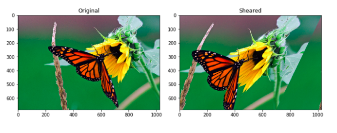
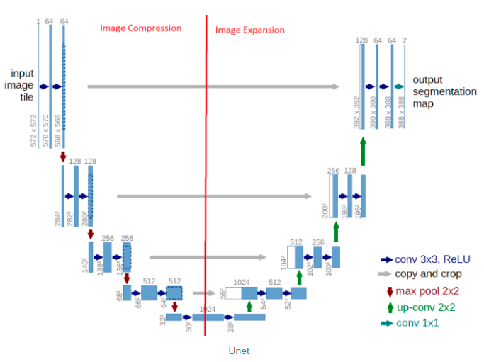

# Image_Segmentation

## Objectif du projet 

L’IA est aujourd’hui omniprésente dans la littérature scientifique de l’imagerie médicale, d’autant plus depuis le développement de nouveaux algorithmes appelés réseaux de neurones convolutifs. En effet, à ce jour, l’IA est très utile dans le domaine de l’imagerie, sur deux volets : la classification des images et la segmentation des organes.

Pour ce projet, nous appliquerons la segmentation sur des images de microcircuits neuronaux de la mouche *Drosophila melanogaster*. Ces images sont tirés de l'article scientifique *An Integrated Micro- and Macroarchitectural Analysis of the Drosophila Brain by Computer-Assisted Serial Section Electron Microscopy* qui présente les avancées dans l’étude des microstructures neurophiles afin d’établir une comparaison entre vertébrés et insectes.

## Les données 

Pour ce projet, le dataset est constitué de 30 images de train, 30 images de test, ainsi que 30 images labels correspondantes aux images d'entrainement. Nous appliquerons la data augmentation agin de grossir notre dataset et obtenir un modèle plus pertinent. 

**Image original**

**Image label**

## Data Augmentation

Pour la data augmentation, nous faisons le choix d'utiliser le module **skimage**. Nous aurions également pu utiliser *ImageDataGenerator()* de **Keras**, cependant cette méthode nous limite. En effet, lors de l'utilisation de cette fonction, seul les images modifiées sont utilisées pour l'entrainement et non les originales.

Nous optons pour un flip horizontale, ainsi qu'une transformation affine de chaque image. Grâce à cette méthode nous passons de 30 à **72 images d'entrainement**. 

**exemple de transformation affine :**

## Le Modèle 

